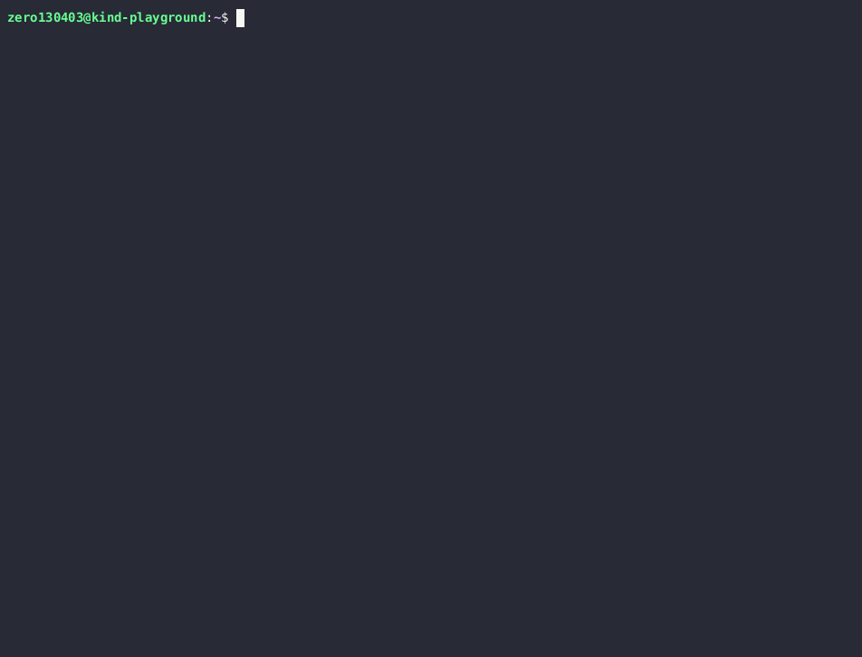

# AsciiArtify
Local development toolchain analysis for Kubernetes
## Introduction

A brief descriptions of best tools for spinning up a Kubernetes cluster on localhost. The following variants we are going to compare:

1. **Minikube** is a lightweight Kubernetes implementation that creates a local virtual machine and deploys a simple Kubernetes cluster within it
2. **Kind (Kubernetes IN Docker)**:
Kind is a tool that allows you to run Kubernetes clusters using Docker containers as "nodes."
3. **K3d** is a lightweight wrapper around K3s, a lightweight and fully compliant Kubernetes distribution designed for resource-constrained environments

## Characteristics


### Availability 
Minikube, Kind and K3d are available on all OS ( Linux, MacOS, Windows). The following architectures are also supported :

| Tools    | Arch                      |
| -------- | ------------------------- |
| minikube | amd64 arm64               |
| kind     | amd64 arm64 ppc64le s390x |
| k3d      | amd64 arm64 armv7         |

### Automatization
1. **Minikube** integrates good with popular automatization instruments like Ansible, Terraform, Chef та Puppet. Process are easily automated with simple minikube commands ``` minikube start ```, ```minikube stop```, ```minikube delete ```
   
2. **Kind** used for integration with CI/CD systems, due to the fact that kind based on Docker - easily integrated with automatization instruments like Jenkins, GitLab CI/CD.

3. **K3d** designed with emphasis on simplicity and ease of use for automated workflows.
Provides simple commands to create, start, and delete clusters that are easy to include in scripts, such as ```k3d cluster create```, ```k3d cluster start```, ```k3d cluster delete```
### Additional features 
1. **Minikube** 
   * has built in dashboard that allows cluster control and monitoring
   * supports adding/removing nodes to the cluster
   * enables easy deployment of addons like Ingress, Ingress DNS, and Registry
   *  supports using Podman as the container runtime instead of Docker.
2. **Kind**
   * supports multi-node Kubernetes clusters for testing more complex scenarios
   * allows configuring the cluster network topology 
   * built-in support for various storage providers (hostPath, tmpfs)
   * provides more granular control through configuration files. You can define cluster size, Kubernetes version, and other settings.
   * requires additional configuration for monitoring. You'll need to deploy monitoring tools like Prometheus within the cluster.
3. **K3d**
    * rapid creation of single or multi-node Kubernetes clusters
    *  offers a balance between ease of use and control. It allows defining cluster configurations with a simple command-line syntax.
    *  similar to Kind, k3d requires separate deployment of monitoring tools.
    * built on top of Rancher's lightweight Kubernetes distribution, K3s, which supports using Podman as the container runtime
## PROS and CONS
### Minikube

Advantages of using Minikube:
* **Easiest to use**: Great for beginners with a simple setup process and built-in kubectl integration
* **Monitoring**: Integrates seamlessly with standard monitoring tools like Prometheus and Grafana.
* **Dashboard**: Offers a built-in dashboard for quick cluster overview.

Disadvantages of using Minikube:
* **Resource overhead**: Uses a VM for the cluster, which can consume more resources compared to container-based solutions.
* **Limited control**: Offers basic cluster control through the minikube command, less customization compared to Kind.
* **Startup time**: Starting a VM can take longer than container-based alternatives.

### Kind

Advantages of using Kind:
* **Fast startup**: Leverages Docker containers for fast cluster creation and deletion.
* **Customization**: Provides granular control over cluster configuration through YAML files.
* **Multi-cluster management**: Allows creating and managing multiple clusters with different configurations.

Disadvantages of using Kind:
* **Monitoring setup**: Requires separate deployment of monitoring tools like Prometheus within the cluster.
* **Complexity**: Configuration via YAML files can be less user-friendly for beginners.
* **Limited driver support**: Primarily relies on Docker for cluster creation.
  
### K3d

Advantages of using K3d:
* **Fast and lightweight**: Similar to Kind, uses Docker containers for quick startup and minimal resource usage.
* **Multi-cluster management**: Enables creation and management of multiple clusters with ease.
* **Configuration file**: Allows defining cluster configurations with a simple command-line syntax, balancing ease of use with control.
* **Container Runtime** can be configured with alternative runtime like Podman

Disadvantages of using Kind:
* **Monitoring setup**: Requires separate deployment of monitoring tools like Prometheus within the cluster.
* **Limited feature set**: Being a lightweight solution, k3d might have a slightly reduced feature set compared to Minikube.

