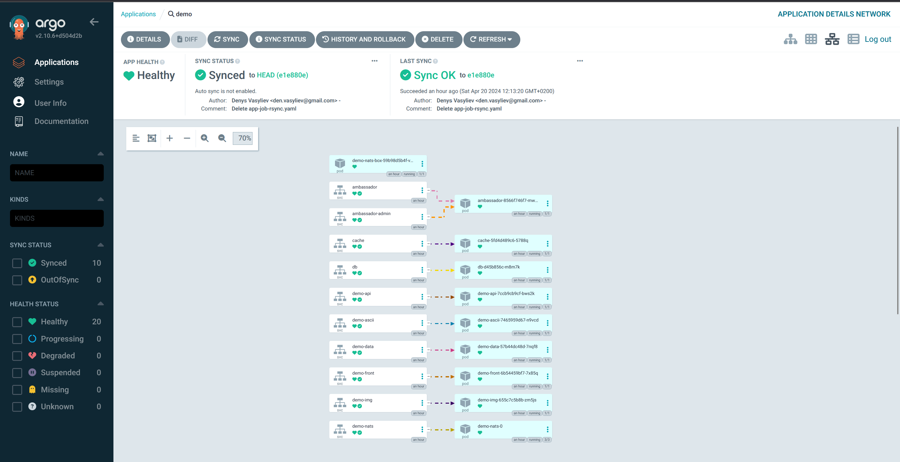

# MVP
We used ArgoCD to deploy an application from product Git repository (https://github.com/den-vasyliev/go-demo-app).

 Once the deployment was successful, we were able to interact with the application's API.

