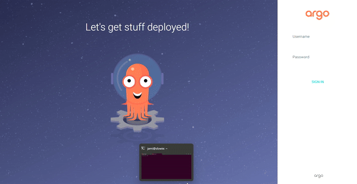

# ArgoCD web Interface access

## Create a cluster
At first, you need to create a kind cluster
```bash
kind create cluster
```
You can check if your cluster is created by running the command:
```bash
kubectl config current-context
```
## ArgoCD Installation
Create the namespace for ArgoCD:

```bash
kubectl create namespace argocd
```
Then, apply the manifest:

```bash
kubectl apply -n argocd -f https://raw.githubusercontent.com/argoproj/argo-cd/stable/manifests/core-install.yaml
```
## Port-forwarding
Kubectl port-forwarding can also be used to connect to the API server without exposing the service:
```bash
kubectl port-forward svc/argocd-server -n argocd 8080:443
```

## Credentials extraction


```bash
kubectl -n argocd get secret argocd-initial-admin-secret -o jsonpath="{.data.password}" | base64 -d; echo
``` 
Alternatively, the usage of the argocd CLI is possible. 


Navigate to localhost:8080 to get access to ArgoCD Interface.




